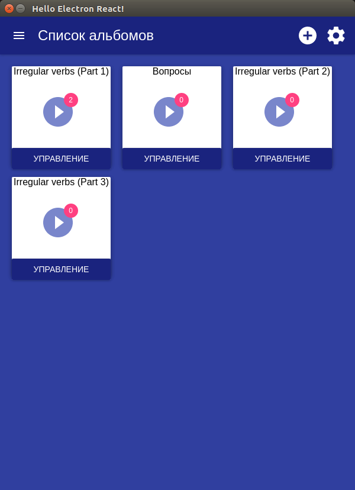
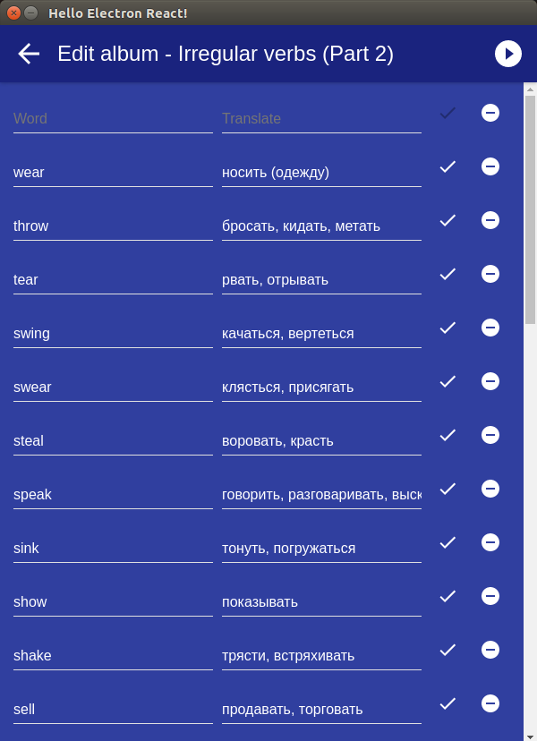
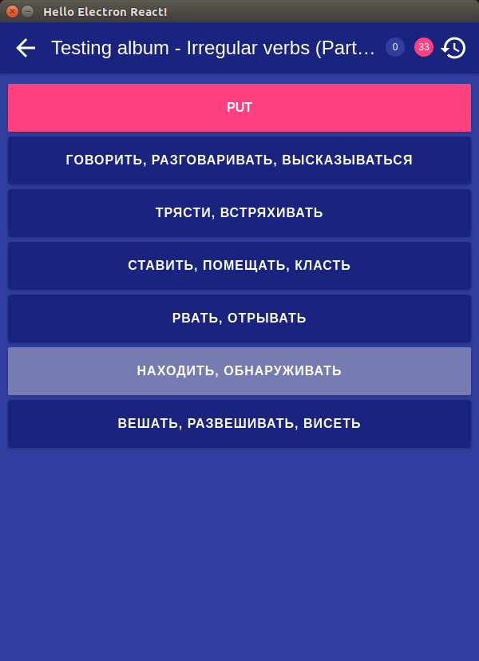

# electron-react-lex
The program for learning foreign words.

## Screenshots
<div>
  
  
  
</div>

## Install

* **Note: requires a node version >= 7 and an npm version >= 4.**
* **If you have installation or compilation issues with this project, please see [our debugging guide](https://github.com/chentsulin/electron-react-boilerplate/issues/400)**

First, clone the repo via git:

```bash
git clone https://github.com/denq/electron-react-lex.git
```

And then install dependencies with yarn.

```bash
$ cd electron-react-lex
$ yarn
```
**Note**: If you can't use [yarn](https://github.com/yarnpkg/yarn) for some reason, try `npm install`.

## Run

Start the app in the `dev` environment. This starts the renderer process in [**hot-module-replacement**](https://webpack.js.org/guides/hmr-react/) mode and starts a server that sends hot updates to the renderer process:

```bash
$ npm run dev
```

Run these two commands __simultaneously__ in different console tabs:

```bash
$ npm run start-renderer-dev
$ npm run start-main-dev
```


## Packaging

To package apps for the local platform:

```bash
$ npm run package
```
For win:
```
$ npm run package -- --win
```

To package apps for all platforms:

First, refer to [Multi Platform Build](https://github.com/electron-userland/electron-builder/wiki/Multi-Platform-Build) for dependencies.

Then,
```bash
$ npm run package-all
```

To package apps with options:

```bash
$ npm run package -- --[option]
```
